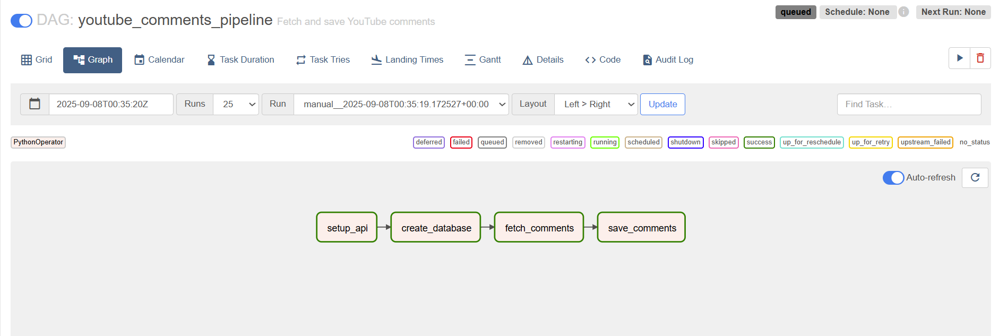

# YouTube Comments Analysis: BBC News “Donald Trump’s Global Tariffs Take Effect”

## Project Objective
This project leverages **Airflow** and the **YouTube API** to automatically collect and analyze public reactions to the BBC News video *“Donald Trump’s Global Tariffs Take Effect.”* Using **Natural Language Processing (NLP)** techniques, the project aims to:

- Programmatically collect YouTube comments using the YouTube API.
- Automate data ingestion with **Apache Airflow** and store the collected comments in a **PostgreSQL** database for efficient querying and management.
- Perform comprehensive analysis on the comments, including **sentiment analysis**, **topic modeling**, and **keyword frequency extraction**, to understand public reactions to Trump’s tariff policies.
- Enable easy data extraction from PostgreSQL for further exploration and analysis.

---

## Key Features
- **Automated Data Collection:** Daily fetching of YouTube comments using Airflow DAGs.
- **Database Storage:** Collected data stored in PostgreSQL for efficient querying.
- **NLP Analysis:** Sentiment analysis, topic modeling, and keyword frequency analysis.

---

## Technologies Used
- **Python:** Data collection, processing, and NLP analysis.
- **Apache Airflow:** Workflow automation and scheduling.
- **PostgreSQL:** Database storage for collected comments.
- **YouTube API:** Source of video comments.
- **NLP Libraries:** `NLTK`, `spaCy`, `TextBlob`, or similar for sentiment and topic analysis.

---

## Data Source
- **YouTube API:** Provides public comments for the specified BBC News video.(https://www.youtube.com/watch?v=6ZFKHzKyfO4
)
- API key is required to access YouTube data.

*Screenshot showing that the DAG `Youtube_comments_etl` ran successfully in Airflow.*

